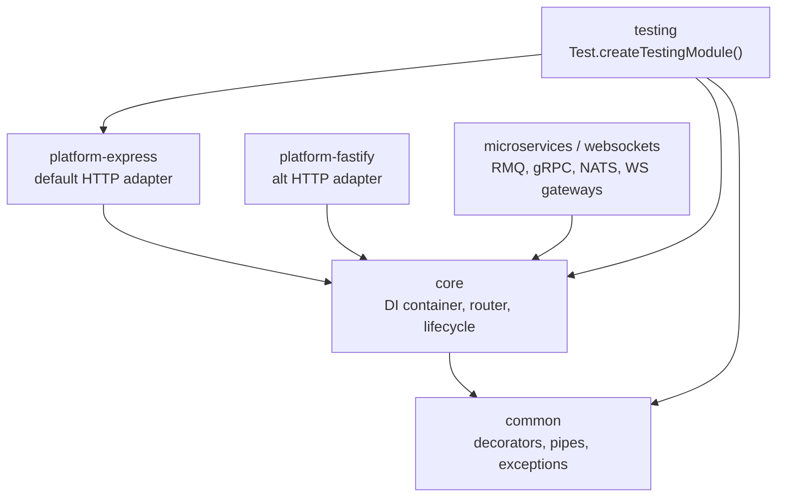
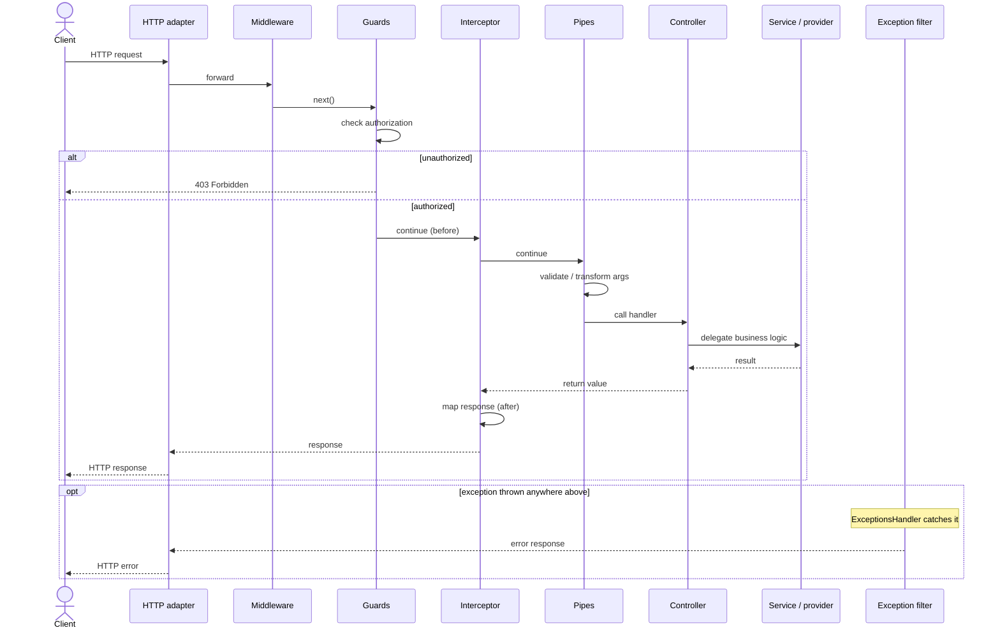

# NestJS Architecture & Change-Impact Guide

> Audience: a developer (or an agent planning an edit) who needs to decide quickly
> whether a proposed change is **Easy / Medium / Hard** before touching code.
>
> How to use this doc: find your change in the **Change Difficulty Cheat Sheet**,
> or locate the package/folder in the **Package Reference** and read the
> Blast Radius + Volatility ratings next to it.
>
> Ratings legend:
> - **Blast Radius** = how many other things break if you change this (consumer count).
> - **Volatility** = how often this area actually changes (2-yr git churn). High churn
>   often means well-trodden + good test coverage, but also active/contended surface.
> - **Difficulty** = realistic effort for a competent contributor to land a *correct* change.

---

## 1. Big Picture

NestJS is a **monorepo** (Lerna + npm workspaces) of independent but layered packages.
The core idea: a **platform-agnostic DI + metadata core** with **swappable HTTP/transport
adapters** plugged in underneath.

```
                         ┌───────────────────────────┐
                         │      @nestjs/common         │  ← decorators, interfaces,
                         │  (decorators, pipes, DTO     │     pipes, exceptions, enums
                         │   contracts, exceptions)     │     (the "vocabulary")
                         └─────────────▲───────────────┘
                                       │ (peer dep, 252 internal refs)
        ┌──────────────────────────────┼──────────────────────────────┐
        │                              │                                │
┌───────┴────────┐          ┌──────────┴─────────┐          ┌───────────┴─────────┐
│  @nestjs/core   │          │ @nestjs/microservices│         │ @nestjs/websockets   │
│  DI container,  │          │  transport servers/  │         │  gateways, socket    │
│  scanner,       │          │  clients (RMQ, Kafka,│         │  lifecycle           │
│  router, request│          │  gRPC, NATS, MQTT…)  │         │                      │
│  lifecycle      │          └──────────▲───────────┘         └──────────▲──────────┘
└───────▲─────────┘                     │                                │
        │ (HTTP adapter contract)       │                                │
 ┌──────┴───────┬──────────────┐   (transport)                  ┌────────┴─────────┐
 │ platform-    │ platform-     │                                │ platform-        │
 │ express      │ fastify       │                                │ socket.io / ws   │
 └──────────────┴──────────────┘                                └──────────────────┘

  @nestjs/testing  ← wraps core + common + platform-express for unit/e2e harnesses
```

**Rendered version** (view in a mermaid-aware viewer, e.g. Cursor, GitHub, VS Code):



**Dependency rule of thumb (from each package's `peerDependencies`):**
- `common` depends on nothing internal → it is the foundation (everything imports it).
- `core` peer-depends on `common` (+ optionally microservices/websockets/platform-express).
- `platform-*` peer-depend on `common` + `core`.
- `microservices` / `websockets` peer-depend on `common` + `core`.
- `testing` peer-depends on `common`, `core`, `microservices`, `platform-express`.

> Source: each `packages/*/package.json` `peerDependencies`.

---

## 2. Sample Data Flow

### 2a. HTTP request lifecycle (the most common path)

A request to a controller route flows through these stages **in this order**
(ordering per https://docs.nestjs.com/faq/request-lifecycle; implementation lives in
`packages/core/router` + `packages/core/middleware`):

```
Incoming HTTP request
        │
        ▼
[1] Platform adapter receives it
     packages/platform-express/adapters/express-adapter.ts
     (or platform-fastify/adapters/fastify-adapter.ts)
        │
        ▼
[2] Middleware (global → module-bound)
     packages/core/middleware/middleware-module.ts
        │
        ▼
[3] Guards (global → controller → route)        ── can short-circuit (403)
     packages/core/guards/guards-consumer.ts
        │
        ▼
[4] Interceptors (pre-controller, "before")
     packages/core/interceptors/interceptors-consumer.ts
        │
        ▼
[5] Pipes (transform/validate params)
     packages/common/pipes/validation.pipe.ts  + route-params-factory
     packages/core/router/route-params-factory.ts
        │
        ▼
[6] Route handler (your controller method)
     dispatched via packages/core/router/router-execution-context.ts
        │
        ▼
[7] Interceptors (post-controller, "after" / response mapping)
        │
        ▼
[8] Exception filters (only if anything above threw)
     packages/core/exceptions/exceptions-handler.ts
     packages/core/router/router-exception-filters.ts
        │
        ▼
[9] Response serialized & sent via the adapter
     packages/core/router/router-response-controller.ts
```

**Rendered version:**



### 2b. Application bootstrap (startup) flow

```
NestFactory.create(AppModule)                      packages/core/nest-factory.ts
        │
        ▼
DependenciesScanner.scan()                         packages/core/scanner.ts
   walks module tree, reads @Module metadata
        │
        ▼
InstanceLoader.createInstancesOfDependencies()     packages/core/injector/instance-loader.ts
   uses Injector to resolve providers              packages/core/injector/injector.ts
        │
        ▼
RoutesResolver registers controllers → routes      packages/core/router/routes-resolver.ts
        │
        ▼
Lifecycle hooks fired (onModuleInit, etc.)         packages/core/hooks/
        │
        ▼
app.listen() → adapter.listen()                    platform-express / platform-fastify
```

### 2c. Microservice message flow (alternate entrypoint)

```
Broker (RMQ/Kafka/NATS/MQTT/Redis/gRPC/TCP) message
        │
        ▼
Transport Server receives                          packages/microservices/server/server-*.ts
        │
        ▼
Deserializer → ListenersController dispatch         packages/microservices/listeners-controller.ts
        │
        ▼
@MessagePattern / @EventPattern handler
   (guards/pipes/interceptors/filters reused from core, RPC variants)
        │
        ▼
Serializer → response published back                packages/microservices/serializers/
```

---

## 3. Package Reference + Impact Analysis

> Churn = number of non-test commits touching files in that area over the last 2 years
> (`git log --since="2 years ago" --name-only`). Refs = internal import count (`rg`).

### `packages/common` — the contract layer (HIGHEST BLAST RADIUS)
- **Role:** Decorators, interfaces, enums, pipes, exceptions, DTO/validation contracts.
  This is the "public vocabulary" every other package and every user app imports.
- **Key files/folders:** `decorators/`, `pipes/`, `exceptions/`, `interfaces/`, `enums/`,
  `serializer/`, `module-utils/`.
- **Blast Radius:** **VERY HIGH** — 252 internal import sites reference `@nestjs/common`;
  also the most-imported package in *user* code. Changing a public interface or decorator
  signature is effectively a breaking change for the whole ecosystem.
- **Volatility:** `common/pipes` (85 churn) and `common/exceptions` (49) are hot;
  `file-type.validator.ts` (29) and `validation.pipe.ts` (13) are individual hotspots.
- **Difficulty:**
  - Adding a *new* exception/pipe/decorator → **Easy–Medium** (additive, isolated).
  - Changing an *existing* interface, decorator signature, or pipe behavior → **HARD**
    (semver-breaking, ripples into core + all platforms + user code).

### `packages/core` — the engine (HIGH BLAST RADIUS, HIGH VOLATILITY)
- **Role:** DI container, module scanner, instance resolution, router, request lifecycle,
  guards/interceptors/pipes *consumers*, exception handling, lifecycle hooks, REPL.
- **Key files/folders:**
  - `injector/` (DI heart) — `injector.ts`, `module.ts`, `instance-wrapper.ts`, `container.ts`
  - `router/` — `router-execution-context.ts`, `routes-resolver.ts`, `router-explorer.ts`
  - `scanner.ts`, `nest-factory.ts`, `nest-application.ts`
  - `middleware/`, `guards/`, `interceptors/`, `pipes/`, `exceptions/`, `hooks/`
- **Blast Radius:** **HIGH** — `injector/injector` referenced 24×, `injector/module` 37×
  internally; behavior changes here affect *every* app at runtime.
- **Volatility:** `core/injector` (79 churn) and `core/router` (43) are among the busiest
  areas in the repo. `injector.ts` alone: 19 changes; `scanner.ts`: 15.
- **Difficulty:**
  - Touching `injector/` or `scanner.ts` (DI resolution, scopes, circular deps) → **HARD**
    (subtle ordering/scope bugs, large existing spec suite must stay green).
  - Router param handling, lifecycle ordering → **HARD–Medium**.
  - Adding a helper/util in `core/helpers` → **Medium**.

### `packages/microservices` — transports (HIGHEST VOLATILITY, MEDIUM BLAST RADIUS)
- **Role:** Transport servers + clients for RMQ, Kafka, gRPC, NATS, MQTT, Redis, TCP;
  message (de)serialization; RPC-flavored guards/pipes/interceptors.
- **Key files/folders:** `server/server-*.ts`, `client/client-*.ts`, `serializers/`,
  `deserializers/`, `listeners-controller.ts`.
- **Blast Radius:** **MEDIUM** — opt-in package; changes to *one* transport are isolated
  to that transport's users. Shared base (`server/server.ts`, `nest-microservice.ts`)
  is higher radius.
- **Volatility:** **HIGHEST in repo** — `microservices/server` (98 churn),
  `microservices/client` (62). Hotspots: `server-rmq.ts` (20), `server-grpc.ts` (18),
  `client-rmq.ts` (14). These depend on external broker libs that change often.
- **Difficulty:**
  - Fix in a *single* transport (e.g. `server-rmq.ts`) → **Medium** (isolated, but needs
    Docker + the broker running for integration tests).
  - Change the shared transport base or interfaces → **HARD**.

### `packages/platform-express` — default HTTP adapter (MEDIUM)
- **Role:** Express implementation of core's `AbstractHttpAdapter` contract; multer uploads,
  CORS, body parsing.
- **Key files:** `adapters/express-adapter.ts` (12 churn), `multer/`.
- **Blast Radius:** **MEDIUM** — default platform, so most apps use it, but it implements a
  stable contract defined in core (`adapters/http-adapter.ts`).
- **Volatility:** Moderate (`platform-express/adapters`: 13).
- **Difficulty:** Adapter method tweak → **Medium**; new upload/CORS option → **Medium**.

### `packages/platform-fastify` — alt HTTP adapter (MEDIUM, HIGH PER-FILE VOLATILITY)
- **Role:** Fastify implementation of the same adapter contract.
- **Key files:** `adapters/fastify-adapter.ts` — **the single most-changed file in the repo
  (30 changes)**, due to Fastify's faster-moving API and routing quirks.
- **Blast Radius:** **MEDIUM** (opt-in), but parity with Express is expected, so changes
  often need a mirrored Express test.
- **Difficulty:** **Medium**, occasionally **Hard** when Express/Fastify parity + routing
  (`find-my-way`, `path-to-regexp`) interact.

### `packages/websockets` + `platform-socket.io` / `platform-ws` (MEDIUM-LOW)
- **Role:** Gateway abstraction (`@WebSocketGateway`), socket lifecycle; concrete adapters
  for socket.io and ws.
- **Key files:** `web-sockets-controller.ts`, `socket-module.ts`,
  `exceptions/base-ws-exception-filter.ts` (10 churn).
- **Blast Radius:** **LOW–MEDIUM** — opt-in, fewer consumers (websockets: 16 churn total).
- **Difficulty:** Adapter/gateway fix → **Medium**; isolated and well-bounded.

### `packages/testing` (LOW BLAST RADIUS)
- **Role:** `Test.createTestingModule()` harness used by users and by Nest's own e2e suite.
- **Blast Radius:** **LOW** (test-time only) but **wide reach** — a bug here breaks *everyone's*
  test suites, so treat behavior changes carefully.
- **Volatility:** Low (14 churn).
- **Difficulty:** **Easy–Medium**.

---

## 4. Change Difficulty Cheat Sheet

| I want to change… | Files to edit | Blast radius | Difficulty | Why |
|---|---|---|---|---|
| Fix a typo in a sample README | `sample/*/README.md` | none | **Trivial** | Docs only |
| Add a new built-in HTTP exception | `packages/common/exceptions/` + index | high (additive) | **Easy** | Pattern is well-established |
| Add a new `ValidationPipe` option | `packages/common/pipes/validation.pipe.ts` | high | **Medium** | Hot file (13 churn), many users, needs specs |
| Fix one microservice transport bug | `packages/microservices/server/server-<x>.ts` | medium | **Medium** | Isolated, but needs Docker + broker for e2e |
| Add option to Express adapter | `packages/platform-express/adapters/express-adapter.ts` | medium | **Medium** | Stable contract; mirror test likely needed |
| Fix Fastify routing/response quirk | `packages/platform-fastify/adapters/fastify-adapter.ts` | medium | **Medium–Hard** | Most-changed file in repo; Express parity expected |
| Change a public interface/decorator in `common` | `packages/common/interfaces/` or `decorators/` | **very high** | **Hard** | Breaking change across entire ecosystem |
| Modify DI resolution / scopes / circular deps | `packages/core/injector/injector.ts`, `module.ts`, `instance-wrapper.ts` | **very high** | **Hard** | 79-churn area, subtle correctness, huge spec suite |
| Change request lifecycle ordering | `packages/core/router/*`, `middleware/`, `guards/` | **very high** | **Hard** | Affects every request; semver-sensitive |
| Add a `core/helpers` utility | `packages/core/helpers/` | low | **Medium** | Additive, internal |
| Improve a testing-module feature | `packages/testing/` | low (wide) | **Easy–Medium** | Test-time only |

**Quick heuristic for an agent/planner:**
1. **Only `sample/` or `*.md` touched?** → Trivial.
2. **Single file under `microservices/server|client`, `platform-*/adapters`, or `websockets`?**
   → Medium (isolated, but check for Docker-based integration tests).
3. **Any file under `packages/common/interfaces|decorators` or `packages/core/injector|router|scanner.ts`?**
   → **Hard** by default — high blast radius and/or high volatility. Expect breaking-change
   review, mandatory specs, and full unit + integration runs.

---

## 5. Mandatory Gates Before Any PR (from `CONTRIBUTING.md`)
- `npm run build`
- `npm run test` (357 unit specs)
- `npm run lint`
- Integration tests (`sh scripts/run-integration.sh`) — **Docker required** — when touching
  routing, adapters, or microservice transports.
- Conventional commits scoped to the package: `fix(core): …`, `fix(microservices): …`,
  `test(common): …` (scopes enumerated in `CONTRIBUTING.md`).
- Major features need a `[discussion]` issue first.

---

## 6. Where the numbers came from (so you can re-run them)
- Inter-package deps: `packages/*/package.json` → `peerDependencies`.
- Blast radius (import counts): `rg -l "@nestjs/common" packages` (252), `"@nestjs/core"` (54),
  `"injector/injector"` (24), `"injector/module'"` (37).
- Volatility (churn): `git log --since="2 years ago" --name-only --pretty=format: -- 'packages/**/*.ts'`
  excluding `*.spec.ts`, aggregated by file and by area.
- Request lifecycle ordering: https://docs.nestjs.com/faq/request-lifecycle.
